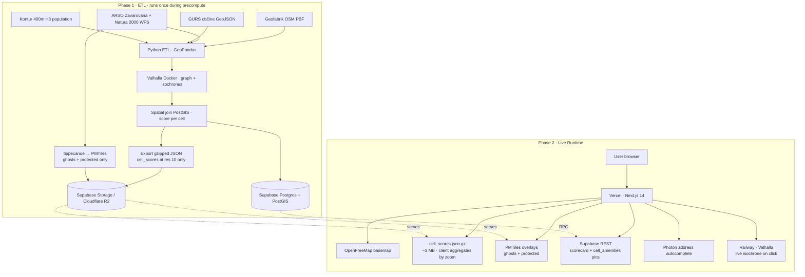

# Architecture

> Companion to `PLAN.md`. This file is the reference doc for *what each component does and why it's there.* Open `ARCHITECTURE.svg` for the visual.

The system has two phases:

1. **ETL / Precompute** — runs once during the build window, produces the static dataset of cell scores.
2. **Live Runtime** — what executes every time a user opens the site. Sub-200 ms first paint.

---

## Visual (Mermaid — renders on GitHub)



---

## Phase 1 — ETL components

### Data sources

All inputs are downloaded ahead of time. See `data/DATA_SOURCES.md` for source URLs and curl commands.

| Component | Format | Why this |
|---|---|---|
| **Geofabrik SI OSM PBF** | `.pbf` (~308 MB) | Daily-refreshed Slovenia extract. Single file; single `osmium tags-filter` run gives us all 8 categories plus buildings and roads. |
| **ARSO Zavarovana območja + Natura 2000** | GeoJSON via WFS | National park, parks, reserves, monuments + EU ecological network. Together cover the hatched "no-build" overlay. Score is suppressed inside these polygons. |
| **GURS občine** | GeoJSON (mirror) | 212 municipality boundaries. Used for Mode C choropleth, hover labels, per-občina aggregations. |
| **Kontur Population SI** | GeoPackage | 400 m H3 population layer fused from Microsoft/Meta/WorldPop building footprints. Drives investor demand + "deserves to live here" mask. |

### Processing steps

1. **`backend/etl/01_extract_amenities.py`** — `osmium tags-filter` on the SI PBF, then GeoPandas to classify each amenity into the 8 buckets (`trgovina`, `izobrazevanje`, `zdravstvo`, `park`, `promet`, `sport`, `storitve`, `delo`). Write to PostGIS table `amenities (id, geom, category)`.

2. **`backend/etl/02_isochrones.py`** — async fan-out to Valhalla:
   - Pedestrian 5/10/15-min isochrones per amenity (37,622 amenities × 3 contours = 112,866 polygons).
   - Store as `amenity_isochrones (amenity_id, mode, polygon)`.
   - Parallelism: 8 concurrent requests against the Valhalla container. Observed bake time: 1.3 min, 464 req/s, 0 failures (was projected as 3–5 h in earlier drafts).

3. **`backend/etl/03_score_cells.py`** — expand each Kontur res-8 populated cell to its **49 res-10 children** (~1.08M cells covering Slovenia's populated land area; rural/forest cells absent from Kontur are skipped by design). For each cell:
   - For each category, point-in-polygon against the **union** of that category's isochrones, iterated widest → narrowest (15 → 10 → 5 min) so the smaller contour wins.
   - `score = Σ I(category_k_present)` → integer 0–8.
   - Compute a `walk_min_per_category` 8-vector (nearest amenity travel time per category) for the scorecard sidebar.
   - Bike time = `walk_min / 2.5` (locked: speed multiplier method).
   - Store in `cell_scores (h3, score, walk_min[], bike_min[], demand_per_category[])`.
   - **Side output:** populate `cell_amenities (h3, amenity_id, category, walk_min)` for the click-to-show-pins feature in Mode A.
   - **Export:** dump `cell_scores` as a single gzipped JSON (~3 MB compressed) to Supabase Storage. This is the file the frontend pulls once on load. Coarser zoom levels are aggregated in the browser via `h3.cellToParent()` — no multi-resolution tile pyramid. (For partial-loading optimisation see TASKS §F1.)

4. **`backend/etl/04_bake_overlays.sh`** — `tippecanoe` reads only the non-aggregable layers (planned-development polygons for Ljubljana ghosts; protected-area polygons for Natura 2000 + zavarovana območja) → small `.pmtiles` files → upload to R2 / Supabase Storage. The hex score layer does **not** go through tippecanoe; it ships as JSON.

### Storage

- **Supabase Postgres + PostGIS + h3-pg** holds: `amenities`, `amenity_isochrones`, `cell_scores`, `cell_amenities` (h3 → amenity_id with walk_min, used for the click-to-show-pins feature), `obcine`, `protected_areas`, `population_grid`, `planned_developments` (Ljubljana ghosts MVP). Auto-generated REST API for the frontend.
- **Supabase Storage / Cloudflare R2** holds:
  - `cell_scores.json.gz` — the score layer (~3 MB compressed at res-10, was ~500 KB when we baked at res-9). Plain JSON, fetched once on load. **Partial-loading by viewport (one file per res-7 parent) is planned — see TASKS §F1.**
  - `protected_areas.pmtiles` — vector tiles for the hatched protected-area overlay.
  - `ljubljana_ghosts.pmtiles` — vector tiles for the planned-development extruded polygons (mock data for V1, real PIS data later).
  - The hex score layer is **not** in PMTiles — it's a single JSON because client-side aggregation handles all zoom levels (see §3a in PLAN.md).

---

## Phase 2 — Live runtime components

### Frontend (Vercel · Next.js 14)
- App Router, Server Components by default, `'use client'` only for the map + interactive panels.
- `/` lands on Mode A (Doma). `/investitor` and `/obcina` for Modes B and C.
- State: Zustand store for selected cell, mode, walk/bike toggle.
- Map: MapLibre GL JS + deck.gl `H3HexagonLayer` for the heatmap, `PolygonLayer` for live isochrone overlay + Ljubljana ghosts.
- **Multi-scale aggregation:** the hex layer's `data` prop is a `useMemo` keyed on the viewport zoom — see PLAN §3a. The score JSON is fetched once on load, then `h3.cellToParent()` + mean aggregation rebuilds the render set in <5 ms whenever zoom changes. No tile-server roundtrips for resolution changes.
- UI: shadcn/ui (`Tabs`, `Sheet` for mobile, `Card`, `Badge`).

### External services
| Service | Endpoint pattern | Cost | Notes |
|---|---|---|---|
| **OpenFreeMap basemap** | `https://tiles.openfreemap.org/styles/positron` | Free, no key | Drop directly into MapLibre `style` — no env var, no signup |
| **Hex JSON (Storage)** | `https://[supabase].supabase.co/storage/v1/object/public/cells/cell_scores.json.gz` | Free tier | One static file, ~3 MB compressed (res-10 baseline). Client aggregates by zoom. Partial-loading per res-7 tile planned (TASKS §F1). |
| **PMTiles overlays (Storage)** | `https://[supabase].supabase.co/storage/v1/object/public/overlays/{protected,ghosts}.pmtiles` | Free tier | CDN-cached, accessed via `pmtiles://` MapLibre protocol |
| **Supabase REST** | `https://[project].supabase.co/rest/v1/cell_amenities?h3=eq.{h3}&walk_min=lte.15` | Free 500 MB DB | Click-to-show-pins query; scorecard data; občina aggregates. Anon key client-side (RLS read-only) |
| **Photon** | `https://photon.komoot.io/api/?q={query}&lang=sl` | Free public | Rate-limited, no key, no SLA |
| **Railway · Valhalla** | `https://valhalla-15min.up.railway.app/isochrone` | ~$5–10/mo Hobby | The single piece of "live" infra |

### Live data flow — Mode A (Doma) example

```
1.  User loads `/` → Vercel SSR returns shell + map skeleton.
2.  Browser fetches OpenFreeMap style + cell_scores.json.gz (~3 MB, cached after first load).
3.  Client computes aggregation: zoomToH3Res(viewState.zoom) → cellToParent + mean → render set.
4.  deck.gl H3HexagonLayer paints ~450 cells at country zoom (instanced WebGL).
5.  User pans / zooms → useMemo re-runs aggregation in <5 ms → render updates instantly.
6.  User types "Ljubljana, Slovenska 12" → debounced fetch to Photon.
7.  Selects suggestion → map flies to lat/lon, side panel opens.
8.  Browser hits Supabase REST: cell_amenities for the resolved H3 cell → ~10–50 amenity pins with walk_min.
9.  Browser hits Supabase REST: cell_scores row → scorecard.
10. Pins rendered as category-colored markers with walk_min badges. Hover = scorecard row highlights.
11. User clicks "Pokaži 15-min doseg" → POST to Railway/Valhalla isochrone.
12. Returned polygon rendered as a soft cyan PolygonLayer over the heatmap.
13. Walk/Bike toggle — local rescale on bike_min column + pin filter (walk_min ≤ 37.5). No server call.
```

---

## What's a single point of failure

The **Railway Valhalla container** is the only piece that *must* be up during the demo for the wow factor (live isochrone on click). Mitigations:

- **Feature flag** `NEXT_PUBLIC_LIVE_ISOCHRONE=true` — if `false`, Mode A skips the polygon overlay and shows just the scorecard. Demo can fall back gracefully.
- **Pre-rendered showcase polygons** — for 5–10 cells you'll definitely demo (Ljubljana center, Maribor center, a remote village in Bohinj), bake the polygon to PostGIS too. Demo machine pulls these as static fallback.
- **Health check endpoint** `/health` polled every 30 s by frontend; if down, banner: "Live routing ni dostopen — prikazujemo predračunane podatke."

Everything else has graceful degradation:
- OpenFreeMap down → fall back to OSM raster basemap.
- Photon down → manual `lat,lon` input.
- Supabase REST down → hex layer still renders from JSON (read-only static); only the click scorecard + amenity pins fail.
- Hex JSON file 404 → empty map, banner.
- PMTiles overlays 404 → no protected/ghosts overlay, hex layer still renders.

---

## Deployment

- **`main` branch on GitHub** → Vercel auto-deploys preview + production (root directory: `frontend/`).
- **PMTiles** uploaded by the ETL run via `aws s3 cp` (R2 is S3-compatible).
- **Valhalla on Railway** — built from `backend/valhalla/Dockerfile` on push to `main` if that path changes.
- **Supabase** — schema migrations via `backend/supabase/migrations/*.sql` in repo. Apply via `supabase db push` from CI.

---

## File / folder map

```
/
├── frontend/                   # Next.js 14 frontend
│   ├── app/                    # App Router pages
│   │   ├── layout.tsx
│   │   ├── page.tsx
│   │   └── globals.css
│   ├── components/             # Map.tsx, scorecard, mode tabs (added incrementally)
│   ├── lib/                    # supabase client, photon, valhalla wrappers
│   ├── public/
│   │   └── data/               # obcine.geojson + small static GeoJSONs for the demo
│   ├── package.json
│   ├── tsconfig.json
│   └── next.config.mjs
├── backend/
│   ├── etl/                    # Python ETL pipeline
│   │   ├── 01_extract_amenities.py
│   │   ├── 02_isochrones.py
│   │   ├── 03_score_cells.py   # → cell_scores.json.gz + cell_amenities
│   │   └── 04_bake_overlays.sh # tippecanoe for ghosts + protected only
│   ├── valhalla/
│   │   ├── Dockerfile          # Valhalla + SI OSM graph (walking + biking)
│   │   └── valhalla.json
│   ├── supabase/
│   │   └── migrations/         # SQL: tables, indexes, RLS policies
│   ├── requirements.txt
│   └── README.md
├── data/
│   ├── 15min-slo/              # raw downloads (PBF, geojson, gpkg) — gitignored
│   └── DATA_SOURCES.md         # canonical reference for every dataset
├── PLAN.md                     # team source of truth
├── CHECKLIST.md                # provisioning checklist
├── ARCHITECTURE.md             # this file
├── ARCHITECTURE.svg            # diagram for slides
├── TASKS.md                    # current state + full roadmap (priority-tagged)
└── README.md                   # top-level entry / orientation
```
